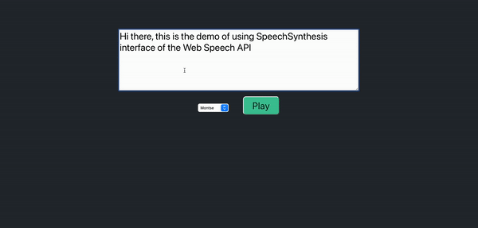

<!-- PROJECT LOGO -->
 

  <h3 align="center">SpeechSynthesis of the Web Speech API</h3>

  

    A simple demo using SpeechSynthesis to do text to speech with highlighting and play/pause feature

## About

Site URL: https://shimmering-paprenjak-93b63c.netlify.app

The `SpeechSynthesis` interface of the [Web Speech API](https://developer.mozilla.org/en-US/docs/Web/API/Web_Speech_API) is the controller interface for the speech service; this can be used to retrieve information about the synthesis voices available on the device, start and pause speech, and other commands besides.

### Built With

[![React][react.js]][react-url]

## Features

- Words highlighting
- User can type the words in
- Voice selection
- Play/pause/resume interaction

<!-- MARKDOWN LINKS & IMAGES -->

[react.js]: https://img.shields.io/badge/React-20232A?style=for-the-badge&logo=react&logoColor=61DAFB
[react-url]: https://reactjs.org/
